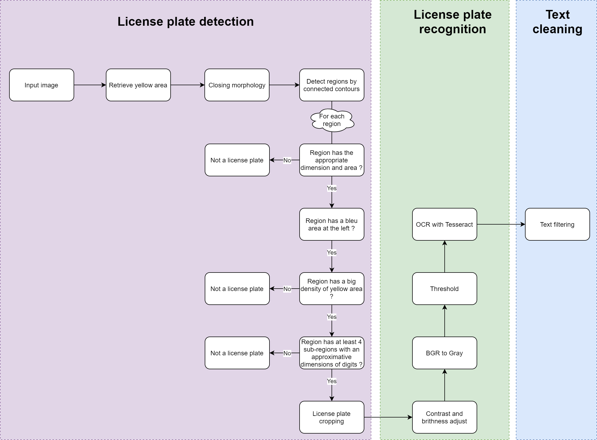
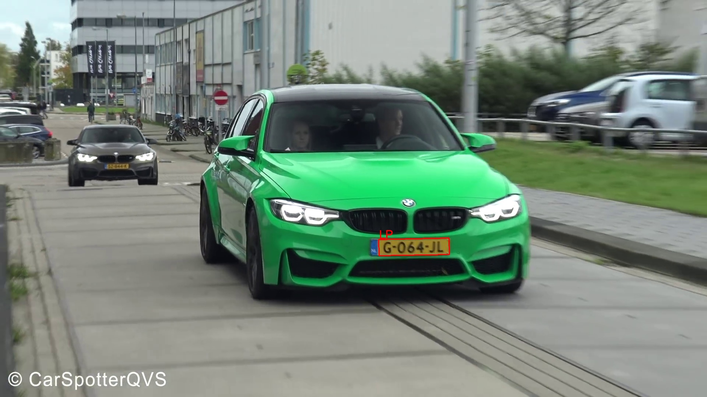
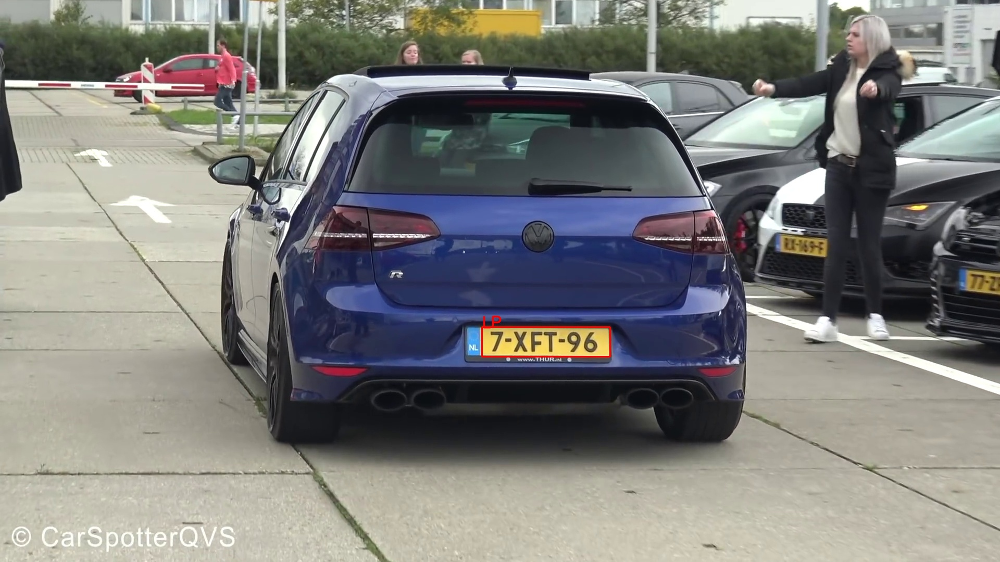

# License plate detection and recognition using color segmentation and Tesseract
[](https://github.com/GuiltyNeuron/ANPR/blob/master/LICENSE)
[](https://github.com/GuiltyNeuron/ANPR/stargazers)

In this work we present Dutch license plate detection based on color segmentation and recognition using Google Ocr engine Tesseract.
We will use python with the two libraries Opencv and Numpy.


### The pipeline below show steps followed :

#### How to use :

Note : this project works on windows os and tesseract is under the folder "extra",
if you want to run it on linux you have to install tesseract wich on you machine
and change the binairie path in "engine.py" function "recognise()"

To detect LP from an image
````
python anpr.py --i data/images/1.jpg
````

you will find result under "/temp" and processing steps under "/temp/steps"

To detect LP from a video
````
python anpr.py --v video.mp4
````

#### Examples :



