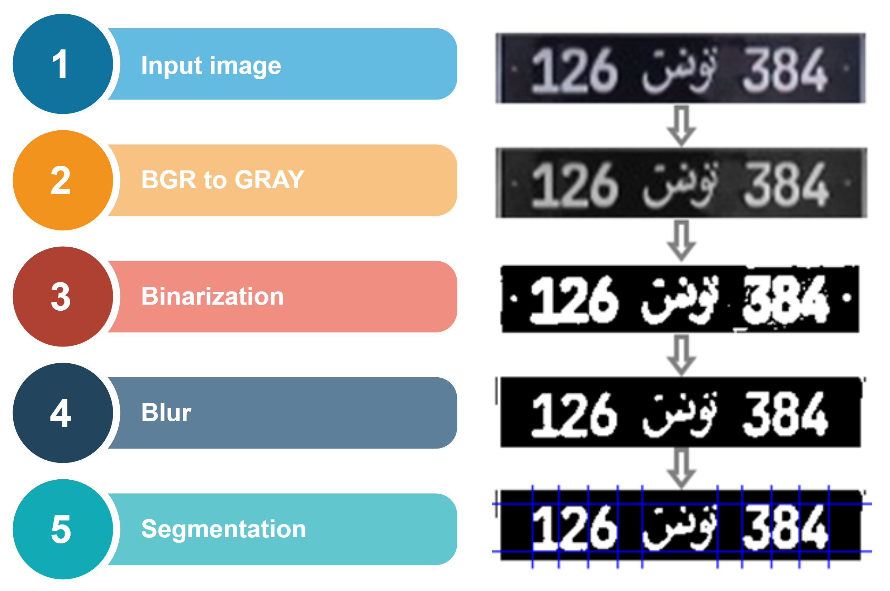

# Tunisia licence plates recognition

In order to read Tunisian plates we detect digits using Sommation of histogram projection after doing some preprocessing then padding and reshaping to have the same input
shape and finally we use a multi layer perceptron for prediction.

### Dataset :

Dataset contains tunisian word in arabic and digits 0-9 with the shape 28*28 for each.

#### Training : 
We trained an MLP model for recognition

#### results :
to improve the recognition, we are going to use a pretrained CNN model on MNIST dataset to train our dataset.

### How to use 

To train models run this command

`` $ python main.py -mode train -d dataset``

To recognize licence plate run this command

`` $ python main.py -mode predict -i test.jpg -model mlp.pkl``
